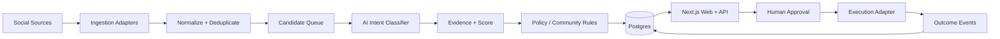

# Intent Revenue OS — Technical Architecture

## Product boundary
The product is an original intent-intelligence platform inspired by the public problem space: discover public buying signals, explain why they matter, require explicit approval, execute safely, and learn from outcomes. It does not copy ReplyHey source code, proprietary data, or branding.

## MVP architecture

## Deployment topology
- **Web/API:** Next.js 16 App Router, Node.js runtime, standalone Docker image.
- **Primary data:** PostgreSQL via Drizzle ORM. Local Docker Postgres; Neon-compatible production connection.
- **Workers:** start as separate Node processes sharing the domain packages; graduate to durable queues/workflows when ingestion volume requires it.
- **AI:** provider abstraction; classification and evidence extraction are persisted separately from raw source posts.
- **Extension:** Manifest V3 execution adapter in a later phase. It receives only human-approved jobs and never needs platform passwords from the backend.
- **MCP:** later exposes product/lead/action tools over authenticated Streamable HTTP.

## Core design decisions
1. `source_post` and `lead` are separate entities. One public post may match multiple products.
2. Lead scores are explainable and decomposed into persisted dimensions.
3. Execution is human-approved by default.
4. Demo mode must work without external credentials.
5. Ingestion, enrichment, approval, execution, and outcome events are observable as separate stages.
6. The modular monolith is intentional for MVP speed; adapters and workers can be extracted without redesigning the domain model.

## Initial scoring
`score = .28 problemMatch + .24 buyingIntent + .18 productFit + .12 switchingIntent + .10 urgency + .08 freshness`

The scoring API must eventually be calibrated against actual reply, signup, trial, and paid-conversion outcomes.
